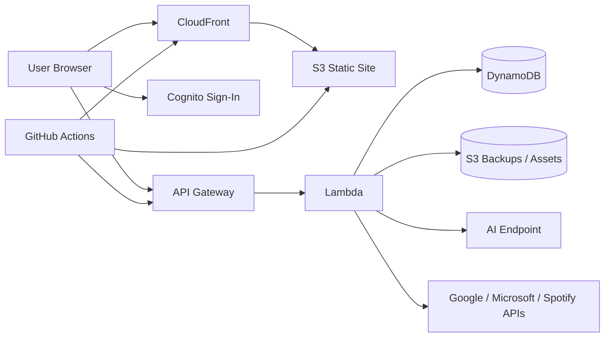

# MyAxis

MyAxis is a serverless personal dashboard built for AWS. It combines work, school, home, projects, and planning into one app with workspace-specific layouts and account-backed sync.

## What Recruiters Should See

This project shows:

- Static frontend hosting on S3 + CloudFront
- Infrastructure as code with Terraform
- User authentication with Cognito
- Backend APIs with API Gateway + Lambda
- Persistent workspace state in DynamoDB
- Per-workspace calendar linking and sync
- GitHub Actions deployment through AWS OIDC
- Local-first browser state plus optional cloud sync

## Core Features

- Workspace switching for different parts of life
- Workspace creation with a limit of 6 total workspaces
- Custom board types for each workspace, including task board, chores, menu, and home layouts
- Task board, calendar, schedule, study, work stories, weather, Spotify, and capture widgets
- Per-widget settings instead of one giant settings panel
- Drag-and-drop widget layout and drag-and-drop kanban cards
- Local backup export and import
- Private scratchpad notes stored in the browser
- Week and month calendar views
- Day-based schedule timeline that merges calendar events and manual items
- Home workspace menu and grocery list
- Optional calendar linking per workspace
- Optional Spotify browser player per workspace
- Cloud-deployed provider IDs can be injected at build time so normal users only see `Login to Spotify` and `Link calendar`
- AI defaults to a low-cost Bedrock model and motivation quotes are cached for the day so opening the app does not call the model every time

## Cloud Architecture

The AWS deployment path is designed to stay simple and reusable:

- S3 stores the static site
- CloudFront serves the app
- Cognito handles sign-in
- API Gateway exposes the backend
- Lambda handles workspace and integration logic
- DynamoDB stores user and workspace state
- EventBridge can drive scheduled sync jobs later
- GitHub Actions deploys the frontend through an AWS role instead of stored AWS keys
- AI requests go through the authenticated `/v1/ai` backend route, default to a low-cost Bedrock model, and can be overridden in a deployer's own AWS account without changing the public repo

High-level flow:

## Repository Layout

- `app.js`, `index.html`, and `styles.css` are the public dashboard shell
- `infra/` contains the Terraform scaffold
- `scripts/` contains build and packaging helpers
- `docs/runbooks/` contains short public runbooks for setup, deployment, and sync
- `.github/workflows/` contains CI and deployment workflows

## Local Development

Open the app with a local web server, then use `config.example.js` as the public sample config and `config.local.js` for private local overrides.

## Customization

- `config.example.js` defines the public starter workspaces
- `config.local.js` is ignored by Git and stays private on your machine
- `config.schema.json` documents the expected workspace shape
- Widget visibility, layout choices, and local state are saved in the browser

## Workspace Sync

Each workspace can keep its own state. In the AWS version, the account-backed backend stores:

- workspace settings
- workspace state
- calendar links
- sync metadata

That means a user can sign in on another device and get the same workspace setup back.

## Deployment

Start with [docs/runbooks/deploy.md](docs/runbooks/deploy.md) for the step-by-step deploy checklist.

The deployment path uses Terraform, GitHub Actions, and AWS-managed infrastructure. The frontend build generates a runtime config file from environment variables, then GitHub Actions syncs the built site to S3 and invalidates CloudFront. In the deployed version, users land on a Cognito sign-in screen before the dashboard loads.

## Current State

The current version is the public dashboard shell plus the AWS scaffold for deployment. The project is being built in phases so the public repo stays readable and the deployment path stays predictable.

## Notes

- Keep personal config and browser backups out of Git
- Keep workspace data tied to the signed-in account in AWS
- Use the runbooks when setting up local development or deployment
- Cloning the repo does not give anyone access to your AWS account; they still need their own AWS environment, variables, and credentials to deploy their own copy
